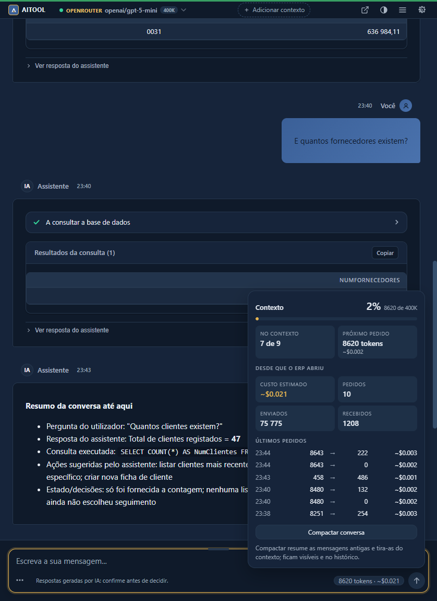

[English](README.md) | **Português**

<div align="center">


**Um assistente dentro do PRIMAVERA v10 que corre inteiramente em máquinas que controla** —
sem conta no fabricante, sem licença por posto, sem créditos contados — com o modelo que
escolher, incluindo um local. Responde a partir dos dados do seu negócio, abre qualquer ecrã
do ERP que descreva por palavras suas, preenche janelas e cria clientes e documentos de venda
através dos objetos de negócio do próprio ERP: primeiro um preview validado pelo ERP, gravação
só a partir do cartão de confirmação que carrega, e cada escrita num registo de auditoria na
sua própria base de dados.

[](https://dotnet.microsoft.com/download/dotnet-framework/net48)
[](https://www.devexpress.com/)
[](https://www.microsoft.com/windows)
[-D9A441.svg)](LICENSE.pt)
[](CONTRIBUTING.md)
[](https://bolalabs.pt)

</div>

---

**Navegue consoante quem é:**

| Quero... | Ir para |
| --- | --- |
| Perceber o que isto é, sem a engenharia | [Em termos simples](#em-termos-simples) |
| Ver o que o assistente consegue mesmo fazer | [O que faz](#o-que-faz) · [As 26 tools](#as-26-tools) |
| Chegar a um ecrã que não encontro nos menus | [Encontre qualquer ecrã por palavras suas](#encontre-qualquer-ecrã-por-palavras-suas) |
| Decidir se é seguro pô-lo perto do meu ERP | [Segurança e confiança](#segurança-e-confiança) · [docs/SECURITY-AND-PRIVACY.pt.md](docs/SECURITY-AND-PRIVACY.pt.md) |
| Instalá-lo, num PC ou numa rede inteira | [Instale uma vez, todos os postos o recebem](#instale-uma-vez-todos-os-postos-o-recebem) · [Instalação (utilizadores finais)](#instalação-utilizadores-finais) |
| Compará-lo com o Cegid Pulse | [Comparação com o Cegid Pulse](#comparação-com-o-cegid-pulse) |
| Compilá-lo a partir do código fonte | [Compilar (licenciados do código)](#compilar-licenciados-do-código) |
| Saber para onde isto vai | [Para lá do Primavera](#para-lá-do-primavera) · [ROADMAP.md](ROADMAP.md) |

---

## Em termos simples

Abra o ERP como sempre. Um botão novo no friso (ribbon) abre um chat. Pergunte, por palavras
suas: *"quanto é que este cliente me deve, e desde quando?"* — e o assistente responde a
partir dos seus dados reais, com os números que o próprio ERP lhe daria. Peça-lhe para
preparar uma proposta e ele preenche-a, mostra-lhe os totais para rever e só grava quando
carregar no botão do cartão de confirmação. Cada alteração que faz passa pelas mesmas
validações que o ERP lhe aplica a si, e fica num registo de auditoria na sua própria base de
dados.

Cinco coisas o distinguem de colar os seus dados num chatbot:

- **Corre onde decidir.** Dentro do seu ERP, nas suas próprias máquinas. Não há nenhum
  servidor da Bola Labs no caminho, nenhuma conta a criar, e com um modelo de IA local nada
  sai sequer do edifício.
- **Escolhe (e paga) a IA diretamente.** OpenAI, Anthropic, OpenRouter, qualquer endpoint
  compatível com OpenAI, ou um modelo local num servidor compatível como o LM Studio — a preços do fornecedor,
  sem subscrição, sem licença por posto e sem créditos contados por cima.
- **Qualquer ecrã, a pedir.** "Abre o extrato de conta do fornecedor", "abre o
  explorador de vendas": encontra a função no catálogo do ribbon e abre-a, seja qual for
  o módulo onde vive. Ninguém precisa de se lembrar onde está um ecrã.
- **Mostra a escrita antes de a fazer.** Criar ou alterar registos corre em dois passos: um
  preview validado pelo próprio ERP, depois um cartão de confirmação com os campos e os
  totais calculados pelo ERP. A gravação acontece com o seu clique nesse cartão e com mais
  nada — e cada gravação, recusa e falha fica num registo de auditoria que pode ler a partir
  do chat.
- **Sabe quem está a perguntar.** O assistente lê o nome, o login e o perfil do utilizador
  com sessão iniciada no ERP e trata-o pelo nome; administradores, super administradores e
  técnicos ganham ainda uma vista de supervisor sobre a auditoria e sobre as conversas de
  todos. O e-mail registado nunca é enviado ao modelo.

O produto é gratuito, para empresas e parceiros. Instale-o a partir do assistente de instalação
([como funciona](#instalação-utilizadores-finais)), configure uma chave de IA e está a
funcionar em minutos.

---

## Como é

<table>
<tr>
<td></td>
<td></td>
<td></td>
<td></td>
</tr>
<tr>
<td><sub>"Dá-me a lista de pendentes desde 2015" — a consulta de pendentes do próprio ERP, em cartões e tabela viva.</sub></td>
<td><sub>Uma escrita é pré-visualizada pelo ERP e só gravada a partir do cartão de confirmação.</sub></td>
<td><sub>Cada gravação, recusa e falha fica na <code>AI_AuditLog</code>, na sua base de dados.</sub></td>
<td><sub>Contexto, tokens e custo por pedido; um clique compacta uma conversa longa.</sub></td>
</tr>
</table>


Capturas na DEMOV10, a empresa de demonstração da Cegid (ecrã 2.8.0, painel de sessão 2.9.0).

**Veja-o a trabalhar.** Um filme de dois minutos e meio da versão publicada na DEMOV10 — o instalador,
um ecrã aberto pelo nome, dados reais, o PDF oficial, a gravação com travão, a tabela de auditoria, uma
skill a correr um processo inteiro — está na página do produto: [bolalabs.pt/pt/aitool](https://bolalabs.pt/pt/aitool/).
Nada nele é uma maquete.

---

## O que faz

O AITOOL é uma extensão WinForms (.NET Framework 4.8) que embute um assistente de chat no
cliente Primavera v10 (SG100) via WebView2. O assistente fala com o modelo à sua escolha —
OpenAI, OpenRouter, Anthropic nativo ou qualquer endpoint compatível com OpenAI (o LM
Studio é um deles) — e atua sobre o ERP através de 26 tools descobertas automaticamente:

- **Lê dados reais do ERP.** Pendentes com a consulta do próprio ERP, análise de vendas por
  período, cliente e artigo, contagens de vendas e compras por ano via `run_query`, saldos de conta corrente com antiguidade, stock por armazém, pesquisa de
  documentos, pesquisa de entidades por nome, código, NIF ou localidade — mais uma tool de
  SQL só de leitura, guardada a `SELECT`/`WITH` e limitada a 500 linhas. As respostas
  tabulares aparecem como tabelas vivas com cartões KPI, e cada linha tem um menu de
  contexto: abrir no ERP, gerar o PDF, abrir o registo, mostrar os seus pendentes.
- **Conduz o cliente do ERP.** Abre qualquer função do ERP pelo nome a partir do catálogo
  do ribbon, em todos os contextos de navegação que a instalação tiver — Vendas,
  Contabilidade, Tesouraria, Recursos Humanos, o que estiver licenciado. Abre registos
  (fichas de cliente, fornecedor e artigo, documentos, extratos de conta) nos seus editores
  nativos. Numa janela aberta lista os campos, preenche campos e células de grelha, clica
  em botões e separadores, lê diálogos modais e fecha janelas — tanto em janelas .NET como
  nos editores VB6 clássicos, através de UI Automation. Quando o botão do ribbon está
  visível o cursor desliza até ele, para que veja o que está a ser clicado.
- **Escreve com preview.** Cria fichas de cliente e fornecedor e documentos de venda
  (propostas, encomendas, faturas) e atualiza fichas existentes, sempre através dos objetos
  de negócio do Primavera, para que todas as validações do ERP corram e a numeração
  continue a ser do ERP. A primeira chamada é validada pelo ERP (`ValidaActualizacao`) e
  devolve um preview com totais reais sem gravar; esse preview é desenhado como um cartão de
  confirmação — os campos, os avisos e os totais calculados pelo ERP — e a gravação só corre
  quando carrega no botão dele. Depois de uma gravação, um aviso diz-lhe que janelas abertas
  do ERP ficaram desatualizadas. Cada gravação, recusa e falha fica escrita na `AI_AuditLog`
  na sua própria base de dados; `/auditoria` no chat lê-a de volta.
- **Os botões de commit passam pelo mesmo cartão.** A automação de janelas pode escrever em
  campos e premir botões, mas um botão que grava ou destrói dados (gravar, guardar, anular,
  apagar, eliminar, remover, confirmar) é recusado a menos que a chamada traga a autorização
  que o cartão emite. A verificação corre sobre o botão que o ERP resolveu, não
  sobre a legenda pedida. Dentro de um diálogo modal a regra inverte-se: só passam recusas
  (Cancelar, Não) e diálogos de um só botão; qualquer outra resposta, incluindo "Sim" a
  "Gravar alterações?", é dada pelo utilizador no próprio ERP, porque um diálogo de que o
  ERP está à espera bloqueia a janela onde o chat vive. Um clique é comunicado como um
  clique: o cartão só diz "Gravado" para o que o ERP confirmou. Cada escrita de campo, escrita em grelha, clique
  de botão e fecho de janela através da automação fica registado na `AI_AuditLog` com o
  utilizador, a empresa, a tool, os argumentos e o resultado. A navegação no ribbon não é
  auditada, e se o próprio insert de auditoria falhar a escrita no ERP mantém-se (a falha
  é registada localmente). Veja [SECURITY.md](SECURITY.md) para o que essa fronteira é e
  não é.
- **Documentos.** O PDF oficial de um documento, produzido pelo relatório Crystal com que a
  série está configurada — ATCUD e código QR são do próprio ERP — abre-se sozinho num
  cartão com visualizador, e Imprimir no cartão abre o diálogo de impressão. Quando a série não tem relatório configurado recebe um aviso
  âmbar e uma folha de dados simples, nunca um documento oficial a fingir.
- **Enriquecimento de entidades.** Dê-lhe um NIF e o assistente preenche a ficha a partir
  de registos públicos (VIES, NIF.pt), valida o NIF por país e mostra um diff campo a campo
  antes de qualquer escrita.
- **Pesquisa web.** Cinco fornecedores — Brave, Exa, Serper, Tavily ou um SearXNG
  self-hosted — com a sua própria chave, para leads e dados de empresas; os resultados são
  explicitamente marcados como conteúdo não confiável.
- **Preenche ecrãs inteiros num só passo.** `set_fields` escreve todos os campos de uma
  ficha, incluindo os dos outros separadores, e `set_grid_row` uma linha inteira de
  documento na própria grelha do ERP, e diz campo a campo onde ficou cada valor. Uma janela
  é lida em menos de meio segundo. Com o modelo opcional de decisões rápidas (Jev,
  desligado por omissão), os nomes que não batem — "NIF" para "Contribuinte", "plafond"
  para "Limite", "editor de documentos de venda" para um caminho do friso — são resolvidos
  em cerca de 0,3 s, os diálogos do ERP são classificados e os botões têm uma segunda
  opinião que só pode pedir mais confirmação.
- **Aprende a sua forma de pedir, para todos os postos.** O addon já traz de origem o que
  os pedidos mais comuns querem dizer nas janelas do ERP, num ficheiro de texto que um
  administrador edita uma vez para todos. Cada posto acrescenta o que aprende — com os
  valores que o ERP aceitou, com a correção que se seguiu a um pedido que não soube
  colocar, e com a sua resposta no cartão ("Era isto" / "Não era isto") — e partilha-o com
  os outros pela base de dados da empresa. O que rejeitar não volta a ser proposto. Só
  nomes de campos, colunas e funcionalidades, nunca os valores; e nenhum ficheiro é
  indispensável: um que falte ou esteja danificado é refeito.
- **Descobre em vez de adivinhar.** Tipos de documento, séries (com validade) e preços de
  artigo vêm da configuração do ERP através de tools de consulta dedicadas.
- **Um chat que se comporta como um produto.** Streaming com indicadores de fase e um
  cancelar que para o turno em menos de um segundo; blocos de raciocínio colapsáveis;
  Markdown, Mermaid e syntax highlighting renderizados totalmente offline (bibliotecas
  vendored, com versões fixas e verificação SRI); chips de sugestão de seguimento;
  histórico de conversas no seu SQL Server com pesquisa e mudança de nome; oito slash
  commands (`/novo`, `/limpar`, `/exportar`, `/config`, `/auditoria [N] | todos [N]`,
  `/compactar`, `/skills`, `/ajuda`); temas claro/escuro/sistema; atalhos de teclado (`Ctrl+N` novo chat,
  `Ctrl+B` sessões,
  `Ctrl+,` definições); janela destacável; exportação para Markdown, HTML ou texto simples.
  O assistente declara que é um sistema de IA, como exige o artigo 50.º do AI Act.

### As 26 tools

| Tool | O que faz |
| --- | --- |
| `search_entities` | Pesquisa clientes, fornecedores e artigos por nome, código, NIF ou localidade |
| `get_entity_details` | Detalhes completos de uma entidade (cliente, fornecedor, artigo) |
| `get_pending_items` | Documentos pendentes por entidade, ou de todas as entidades; aceita argumentos de data |
| `query_account_balance` | Saldo de conta corrente de um cliente/fornecedor, com escalões de antiguidade |
| `query_documents` | Pesquisa documentos comerciais por tipo, entidade, data ou estado |
| `analyze_sales` | Análise de vendas por cliente, artigo ou período; top-N e comparação de períodos. O âmbito vem da classificação de documentos do próprio ERP, pelo que notas de crédito e devoluções são descontadas — os valores são líquidos |
| `check_stock` | Stock atual, mínimo e máximo de um artigo por armazém |
| `render_document` | Cabeçalho e linhas de um documento comercial, mostrados como cartão interativo |
| `run_query` | SQL só de leitura escrito pelo modelo — apenas `SELECT`/`WITH`, escrita/DDL bloqueadas por uma guarda |
| `open_record` | Abre um registo (ficha, documento, extrato de conta) no seu editor nativo do ERP |
| `open_erp_function` | Abre qualquer função do ERP pelo nome, navegando o ribbon; lista o inventário em caso de dúvida |
| `interact_erp_window` | Lista janelas e campos, preenche campos e células de grelha, clica botões — janelas .NET e nativas (VB6) |
| `print_document` | Gera o PDF do relatório oficial de um documento; o cartão oferece Ver, Imprimir, Guardar como… e o resto em Mais |
| `get_sales_document_types` | Lista os tipos de documento de venda configurados nesta instalação do ERP, cada um com a natureza que o ERP lhe atribui (orçamento, encomenda, guia, fatura) |
| `get_sales_series` | Lista as séries de um tipo de documento, com a série por omissão e a validade à data de hoje |
| `get_article_price` | Preço/desconto sugerido pelas regras de preços do ERP (listas de preços, regras por cliente, escalões de quantidade) |
| `create_entity` | Cria uma ficha de cliente/fornecedor via BSO — preview primeiro, gravação a partir do cartão de confirmação |
| `create_sales_document` | Cria um documento de venda via BSO — preview com totais reais, gravação a partir do cartão de confirmação |
| `update_entity` | Atualiza campos de uma ficha de cliente/fornecedor existente — preview primeiro, gravação a partir do cartão de confirmação |
| `create_article` | Cria um artigo (mercadoria ou serviço) via BSO, com unidade, código de IVA e preço — preview primeiro, gravação a partir do cartão de confirmação; o código de IVA nunca é adivinhado |
| `update_sales_series` | Prolonga ou reativa uma série de vendas quando o ERP recusa um documento por a série ter acabado; só administradores e técnicos — preview primeiro, aplicada a partir do cartão de confirmação |
| `create_opportunity` | Cria uma oportunidade de venda no CRM para um cliente existente — preview primeiro, gravação a partir do cartão de confirmação |
| `draft_email` | Prepara um rascunho de e-mail (para, assunto, texto) num cartão; o utilizador abre-o no seu programa de correio, nada é enviado |
| `use_skill` | Carrega as instruções de uma skill — um fluxo de trabalho escrito em Markdown por quem usa o ERP; ver [docs/SKILLS.pt.md](docs/SKILLS.pt.md) |
| `enrich_entity` | Preenche uma ficha a partir de registos públicos pelo NIF (VIES, NIF.pt), mostrando um diff campo a campo antes de qualquer escrita |
| `web_search` | Pesquisa na web pública (Brave, Tavily, Exa, Serper ou um SearXNG self-hosted); só de leitura, resultados marcados como conteúdo não confiável |

Cada tool pode ser ligada ou desligada individualmente nas definições; a camada de tools
inteira tem um kill switch (`ErpTools:Enabled` / `AITOOL_ERP_TOOLS_ENABLED`).

Um fluxo típico de ponta a ponta — *"esta empresa enviou-nos um email, faz-lhes uma
proposta"*: `web_search` encontra a empresa → `search_entities` verifica se já existe →
`create_entity` (preview → cartão → o seu clique) → `get_sales_document_types` + `get_sales_series`
escolhem o tipo de proposta real e uma série válida → `create_sales_document` (preview com
totais calculados pelo ERP → cartão → o seu clique) → `print_document` para o PDF oficial.

---

## Ensine-lhe os seus próprios fluxos

Uma skill é uma pasta com um `SKILL.md`: uma descrição que o assistente lê para saber quando
a skill se aplica, e os passos a seguir — que ferramentas, por que ordem, o que confirmar.
Sem código, sem plugin para instalar: quem sabe escrever um procedimento para um colega sabe
escrever uma. As skills que vêm com cada versão ficam na pasta do próprio addon. Ao lado
delas, uma pasta partilhada `%ProgramData%\AITOOL\Skills`, onde só administradores escrevem,
guarda as que a sua organização acrescentar, e cada utilizador tem uma pasta pessoal que se
sobrepõe às duas. Definições → Skills lista-as com a contagem, uma pill Incluída / Partilhada /
Minha, a descrição e as frases que ativam cada uma, e desliga-as — desligar uma skill
partilhada só o afeta a si, e só um supervisor tem o botão que abre a pasta partilhada.
`/skills` mostra-as no chat. O campo `tools` de uma skill orienta o assistente; não restringe
as ferramentas que ele pode chamar.

A skill incluída `prospecao-de-leads` corre o fluxo de prospeção inteiro: pesquisa web de
empresas-alvo, verificação se a empresa já existe, ficha de cliente e oportunidade de venda
no CRM (cada uma pré-visualizada, cada uma gravada a partir do seu cartão de confirmação) e um
rascunho de e-mail que abre no seu programa de correio para revisão. Nada é gravado nem
enviado sem si.
O formato e as regras estão em [docs/SKILLS.pt.md](docs/SKILLS.pt.md).

## Encontre qualquer ecrã por palavras suas

O Primavera v10 tem centenas de funções espalhadas por módulos, contextos de navegação e
menus aninhados, e a maioria das pessoas usa uma dúzia delas. As outras são as que se
procuram uma vez por trimestre e nunca se fixam. O AITOOL lê o catálogo do ribbon do
próprio ERP no arranque — todas as funções, em todos os contextos de navegação que a
instalação tem licenciados — para que possa pedir um ecrã como pediria a um colega: *"abre
a ficha do cliente 0031 e os pendentes dele"*, *"abre o explorador de vendas"*, *"leva-me ao extrato
de conta deste fornecedor"*. O assistente encontra a função, muda de contexto se for preciso,
abre-a, e quando o botão do ribbon está visível o cursor desliza até ele para que aprenda
onde estava. Quando não tem a certeza, lista os candidatos em vez de adivinhar.

O mesmo mecanismo conduz o que vem a seguir: com a janela aberta, o assistente lista os
campos, preenche-os, passa pelos separadores, lê o diálogo que o ERP devolve e fecha a
janela — tanto nos ecrãs .NET modernos como nos editores VB6 clássicos.

Isto é também um ângulo de acessibilidade, dito com cuidado. Tudo o que o ERP expõe por
menus pode ser pedido por texto, o que ajuda quem não sabe onde vive um ecrã, quem tem
dificuldade em percorrer ribbons aninhados e quem trabalha melhor a escrever do que a
apontar. Não torna o Primavera uma aplicação totalmente acessível, e a entrada por voz está
no roadmap, não no produto.

---

## Instale uma vez, todos os postos o recebem

O Primavera v10 instala-se tipicamente em cliente-servidor: o ERP vive num servidor e cada
posto de trabalho chega à pasta partilhada `SG100` (mapas, configuração, extensões) através
de uma partilha Windows. O AITOOL é uma extensão nessa pasta, por isso o setup corre **uma
vez**, na máquina que tem o `SG100`, e cada posto apanha o assistente no arranque seguinte.
Não há nada a instalar por posto: um posto de trabalho precisa apenas do runtime Microsoft
Edge WebView2, que o Windows 10 e 11 já trazem e que o setup verifica e instala se faltar.

O setup é um assistente Windows normal que faz o trabalho do lado do ERP sozinho: encontra
a instalação do Primavera, deteta ERPs multi-instância, regista o addon no ecrã de
Extensibilidade do ERP (comum, ou por empresa) e remove esse registo na desinstalação. Os
departamentos de IT têm um modo silencioso. Não conhecemos outro addon Primavera que venha
com um instalador que se regista a si próprio; os detalhes estão em
[Instalação (utilizadores finais)](#instalação-utilizadores-finais), e as notas de rede em
[INSTALL.pt.md](INSTALL.pt.md).

Cada utilizador abre depois o assistente a partir do ribbon e introduz a sua própria chave
de fornecedor, guardada cifrada por utilizador Windows (DPAPI) e enviada apenas a esse
fornecedor. Uma empresa que queira partilhar uma chave, ou correr um modelo local num
servidor, aponta o endpoint para lá.

---

## Arquitetura

<div align="center">

</div>

O addon é alojado in-process pelo ERP. A superfície de chat é uma página WebView2 servida a
partir de um host virtual (`https://aitool.local`) com uma CSP que não permite nenhum CDN —
marked, DOMPurify, highlight.js e Mermaid são vendored com versões fixas e hashes SRI, pelo
que a renderização funciona totalmente offline. JS e C# comunicam por `PostWebMessageAsJson`
/ `ExecuteScriptAsync`, abstraídos atrás de uma interface `IChatView`.

Um turno corre através do `ToolCallOrchestrator`: faz streaming do fornecedor ativo, executa
tool calls até ao limite de iterações configurado (1-15), reproduz o transcript de tools nas
continuações e é dono do cancelamento por turno. Os fornecedores estão atrás de uma
abstração `IAiProvider` — uma implementação para endpoints compatíveis com OpenAI e um
adaptador Anthropic nativo (`/v1/messages`, thinking com níveis de esforço, prompt caching).
As tools implementam `IErpTool`, são marcadas com `[Tool]` e são descobertas por reflexão no
arranque.

Cinco projetos compõem a solução: **AITOOL** (o addon), **OpenAI.SDK** (cliente vendored
baseado no Betalgo — streaming e tool calling, sem dependência do AITOOL), **Shared.Config**
(configuração unificada + telemetria), **ReportEngine** (wrapper de Crystal Reports usado
para os PDFs oficiais de documentos) e **Installer** (conduz a construção do Inno Setup).
Detalhes em [ARCHITECTURE.md](ARCHITECTURE.md).

---

## Segurança e confiança

Deixar um modelo de linguagem perto de um ERP é um problema de confiança antes de ser um
problema de funcionalidades. As salvaguardas, pela ordem em que importam:

| Salvaguarda | Como funciona |
| --- | --- |
| **As escritas passam por um cartão de confirmação** | `create_entity`, `create_article`, `update_entity`, `update_sales_series`, `create_sales_document`, `create_opportunity` e qualquer botão de gravação premido por `interact_erp_window` são pré-visualizados primeiro: o ERP valida o rascunho e devolve os campos e, nos documentos, os totais que calculou. A aplicação desenha essa pré-visualização como um cartão e, ao fazê-lo, emite uma autorização de uso único — válida 15 minutos e ligada aos argumentos exatos pré-visualizados. A gravação só corre com essa autorização, que nasce do clique do utilizador no cartão e nunca é mostrada ao modelo. Uma chamada com `confirm=true` sem ela é recusada e registada na `AI_AuditLog` como recusa; escrever "sim" não grava nada. As gravações são single-flight — uma segunda gravação concorrente é recusada. O que isto não é: uma fronteira de base de dados. Limita o que o modelo pode desencadear, não o que alguém com a ligação SQL consegue fazer. |
| **Visibilidade por utilizador** | As conversas e as entradas de auditoria são do utilizador ERP que as criou. Administradores, super administradores e técnicos do ERP veem um badge Supervisor, o `/auditoria todos` e um interruptor "Todos os utilizadores" na lista de conversas; a conversa de outro utilizador abre só de leitura, e só o dono a pode renomear ou apagar. É um controlo de aplicação decidido em C# a partir do perfil do ERP, não uma permissão de base de dados. |
| **As escritas passam pelos objetos de negócio do ERP** | Os registos são criados via o modelo de objetos BSO do Primavera, pelo que todas as validações do ERP correm e os números de documento são atribuídos pelo ERP. Não há escritas diretas nas tabelas core do ERP. O `run_query` é só de leitura por guarda aplicacional, não por permissão de base de dados — corre na ligação do próprio ERP, pelo que empresas que queiram uma segunda barreira devem apontar o addon para um login SQL só de leitura. |
| **SQL com guarda** | O `run_query` aceita apenas `SELECT`/`WITH`: uma blocklist rejeita palavras-chave de escrita/DDL/sistema (`INSERT`, `DROP`, `EXEC`, `xp_*`, `OPENROWSET`, …) depois de remover comentários, parêntesis retos e homóglifos Unicode para impedir contornos; o empilhamento de statements (`;`) é recusado; o número de linhas é limitado do lado do servidor. |
| **Conteúdo não confiável é sinalizado** | O system prompt fixa uma regra: texto devolvido por tools (páginas web, resultados SQL, campos do ERP) é dado para analisar, nunca instruções para seguir. Os resultados do `web_search` levam adicionalmente `untrusted_content: true` mais um aviso inline, e formulações de injeção conhecidas são sinalizadas para a telemetria. |
| **Automação de janelas contida** | Um botão de gravar, anular ou eliminar carregado pela automação é recusado a menos que a chamada leve a autorização do cartão de confirmação; o prompt diz ainda ao assistente para preencher campos, resumir e parar. Corre uma interação de janela de cada vez. |
| **Chaves cifradas em repouso** | As chaves de API (fornecedores e pesquisa web) vivem num cofre cifrado por utilizador com DPAPI (`secrets.dat`), nunca em configuração em texto simples. Os endpoints de pesquisa web têm de ser HTTPS e os redirects estão desativados, para que uma chave não possa fugir para um destino de redirect — a exceção é um SearXNG self-hosted em loopback ou numa gama privada, que não leva chave e só aceita HTTP simples quando explicitamente permitido. |
| **Higiene de telemetria** | Os logs são locais (NLog, rotação diária). Nenhum DSN do Sentry é distribuído; se um operador configurar um, as builds RELEASE enviam eventos de nível erro, sessões de release health e uma amostra de 10% de traces, com chaves de API, passwords de connection strings e caminhos de utilizador redigidos antes do envio e sem conteúdo do chat. As pesquisas web nunca são registadas — podem conter nomes e NIFs. |
| **Interruptores** | Cada tool liga e desliga individualmente nas definições; `ErpTools:Enabled` desliga a camada de tools inteira, deixando um chat simples. |

O que sai da máquina, o que fica guardado na sua base de dados e o que limita o assistente
está em [docs/SECURITY-AND-PRIVACY.pt.md](docs/SECURITY-AND-PRIVACY.pt.md) — escrito para a
pessoa que tem de aprovar a instalação.

### Não aplica as permissões por utilizador do Primavera

Vale a pena saber antes de o pôr em produção, porque decide a quem o dá.

As tools que passam pelo modelo de objetos do ERP (criar e atualizar registos, abrir
janelas, imprimir) atuam como o utilizador do ERP com sessão iniciada e batem nas regras do
próprio ERP. **As tools que leem por SQL não** — `search_entities`, `query_documents`,
`query_account_balance`, `analyze_sales`, `check_stock`, `render_document` e `run_query`
usam a ligação à base de dados do próprio ERP, e as permissões do Primavera são aplicadas
pela aplicação, não pela base de dados. Um utilizador que não pode abrir saldos de
fornecedores no ERP pode na mesma pedi-los ao assistente.

Duas formas de o limitar: desativar as tools que uma dada população não deve ter
(`Assistant:DisabledTools`), ou apontar o addon para um login SQL só de leitura restrito às
views que aceitar. O mapeamento de permissões por utilizador não está implementado e não
está planeado para a v1.

---

## O que custa

O addon é gratuito ao abrigo da [Licença Community](LICENSE.pt). Não há subscrição, licença por posto, conta a criar
nem contadores — nada no AITOOL conta as suas ações.

O que paga é o seu fornecedor de IA, diretamente, ao preço dele. Uma ordem de grandeza, não
uma promessa: uma pergunta típica que corre duas ou três tools carrega o system prompt mais
os schemas das tools, portanto conte com alguns milhares de tokens de entrada por turno e
algumas centenas de saída. Os modelos mais baratos resolvem as consultas do dia a dia;
guarde os fortes para os fluxos de documentos com vários passos. O contador no fundo do chat
abre o painel de sessão: contexto ocupado, mensagens dentro e fora do contexto, pedidos,
tokens enviados e recebidos desde que o ERP abriu, o custo (o OpenRouter devolve o valor
faturado de cada pedido e o painel mostra-o como tal; nos outros casos o addon avalia os
tokens com a lista de preços do fornecedor ou uma tabela interna para OpenAI e Anthropic),
os últimos pedidos um a um e o peso do próximo pedido. O tamanho do contexto é o que o
fornecedor publica para o modelo. Quando o modelo raciocina, um chip ao lado da caixa de
escrita muda o esforço (Ctrl+Shift+E): "Desligado" responde mais depressa, "Profundo" pensa mais
em pedidos com vários passos. `/compactar` (ou o botão do painel) pede ao modelo um resumo das
mensagens antigas e tira-as do pedido; ficam visíveis e no histórico. Ainda assim, vigie a
primeira semana no dashboard do próprio fornecedor.

Custo marginal zero é possível: aponte-o para um endpoint local compatível com OpenAI
(LM Studio, ou o servidor de inferência da sua empresa) e nada é faturado e nada sai da
máquina. Abaixo de cerca de 8B parâmetros com quantização de 4 bits, o tool calling deixa de
ser fiável — esse é o limite prático, não uma lista de modelos suportados.

## O que não vai fazer

Limites deliberados, não lacunas à espera de serem preenchidas:

- **Sem workflows autónomos.** As cadeias de tools têm limite por turno; não corre sem
  supervisão.
- **Sem lançamentos contabilísticos, sem eliminações, sem documentos de compra, sem criação
  de artigos.** Documentos de venda, fichas de cliente/fornecedor e oportunidades de venda
  do CRM são a superfície de escrita. O `draft_email` prepara uma mensagem para revisão e
  nunca a envia.
- **Sem entrada de faturas ou documentos.** Não lê uma fatura em PDF e lança-a. Está no
  roadmap, e condicionado pelas regras portuguesas: documentos fiscais são emitidos por
  software certificado pela AT, nunca por um assistente.
- **Sem carregamento de plugins.** Nada corre dentro do processo do ERP por ser largado numa
  pasta.
- **Sem exportação de tabelas de resultados para Excel ou CSV.** As conversas exportam para
  Markdown, HTML ou texto simples; as tabelas oferecem cópia.
- **Não substitui conhecer o seu ERP.** Responde a partir dos seus dados e conduz os seus
  ecrãs; não audita a sua configuração nem corrige os seus dados mestre.

A interface está em português (pt-PT). O assistente responde na língua em que lhe escrever.

---

## Começar

### Comparação com o Cegid Pulse

A Cegid tem o seu próprio assistente para o Primavera. A comparação que as pessoas pedem,
com base no material publicado pela própria Cegid:

| | Cegid Pulse | AITOOL |
| --- | --- | --- |
| Onde corre | Um serviço cloud da Cegid, acedido pela API deles — mesmo quando o seu ERP é on-premise | No processo do ERP, na sua máquina |
| Conta obrigatória | Uma Cegid Account por utilizador | Nenhuma |
| Edição | Apenas Evolution | Evolution, Executive e Professional (ver requisitos) |
| O modelo | O da Cegid | O seu — OpenAI, OpenRouter, Anthropic, qualquer endpoint compatível com OpenAI, ou um local |
| Custo de uma ação | Franquia de tokens por edição, com recargas pagas | O que o seu fornecedor lhe cobrar, diretamente |

Não são substitutos: o Pulse está embutido nos workflows do ERP pelo fabricante e é
suportado por ele. O AITOOL existe para o caso em que a resposta a "para onde vão os dados
do meu negócio" tem de ser "para lado nenhum", e em que a escolha do modelo é sua.

### Requisitos

- ERP Primavera v10 (SG100) licenciado, versão 10.20 ou superior. Evolution e Executive
  estão validadas; Professional instala com as mesmas regras e aguarda confirmação de um
  cliente. Builds v10 mais antigas, que ainda embebem o browser Chromium (CefSharp), não
  têm o componente WebView2 em que o chat corre, e o setup di-lo antes de copiar seja o que
  for
- Microsoft .NET Framework 4.8 (o ERP corre a partir do 4.7.2; o setup instala o 4.8 se
  faltar)
- Microsoft Edge WebView2 Runtime, 125 ou superior recomendado (instalado pelo setup quando
  falta)
- SQL Server (a instância do próprio ERP; guarda também o histórico de chat)
- Uma chave de API de pelo menos um fornecedor (OpenAI, OpenRouter, Anthropic) — ou um
  endpoint local compatível com OpenAI, como o LM Studio, que não precisa de chave

### Instalação (utilizadores finais)


A instalação é um assistente de instalação Windows normal — descarregar, seguinte, seguinte,
concluído. O setup ainda não está assinado digitalmente, por isso o Windows SmartScreen
mostra um aviso na primeira execução; o SHA256 nas notas da release é a forma de verificar o
download. O que faz por si, por ordem:

1. **Encontra a sua instalação do Primavera** automaticamente
   (`PERCURSOSGE100`/`PERCURSOSGV100`/`PERCURSOSGP100` → registry → instalação anterior →
   pergunta se tudo o resto falhar), e recusa-se a correr com o cliente do ERP aberto.
2. **Verifica o posto antes de copiar seja o que for**: versão do ERP por edição, o
   componente WebView2 do ERP, DevExpress 21.2, .NET Framework 4.8, o WebView2 Runtime
   (instalado automaticamente quando falta) e escrita em cada destino. Os pontos a vermelho
   explicam o que corrigir; o resto avisa e continua.
3. **Trata todas as edições e instâncias**: cada pasta `Config[_instância]\EV`, `\LE` ou
   `\LP` com o respetivo executável é um alvo, todos pré-selecionados, com uma consulta
   opcional de PRIINSTANCIAS no SQL Server.
4. **Regista o AITOOL no ecrã de Extensibilidade do ERP** por si — como extensão comum ou
   para empresas específicas, escrito na base de dados PRIEMPRE de cada instância. Sem
   configuração manual do ERP.
5. **Verifica o resultado** alvo a alvo (ficheiro presente, MD5 igual à linha registada,
   executável encontrado) e guarda um relatório que pode enviar ao apoio.
6. **Desinstala de forma limpa**: o mesmo estado é usado para remover o registo na
   desinstalação.

Para departamentos de IT, o deployment silencioso é suportado:
`/VERYSILENT /INSTANCES=ALL /EDITIONS=ALL /SQLSERVER=SRV /REGISTER=COMMON`, ou
`/VERYSILENT /DIR="<SG100>\Config\LE\Extensions\AITOOL"`. Os passos de cópia manual estão em
[INSTALL.pt.md](INSTALL.pt.md).

Numa instalação cliente-servidor, corra-o uma vez na máquina que tem o `SG100`; os postos
não precisam de nada além do runtime WebView2, que o setup verifica e instala se faltar
(veja
[Instale uma vez, todos os postos o recebem](#instale-uma-vez-todos-os-postos-o-recebem)).

Depois arranque o Primavera, abra o assistente a partir do ribbon e defina o fornecedor, o
modelo e a chave de API no modal de definições. A chave fica guardada cifrada (DPAPI) no
perfil desse utilizador. Entre o download e a primeira resposta não há mais nada a tratar:
nenhuma conta a criar, nenhum servidor a levantar, nenhuma configuração do ERP a editar à
mão.

### Compilar (licenciados do código)

O código não é público; compilá-lo depende de um acordo escrito à parte — veja
[COMMERCIAL.md](COMMERCIAL.md). A nota jurídica que interessa a quem lê aqui: compilar não
precisa de nenhuma instalação do ERP, porque todas as referências Primavera resolvem a
partir de uma pasta `Lib\` vendored de assemblies de referência de compilação, que nunca são
copy-local nem distribuídos. Em runtime o addon liga-se aos assemblies do próprio ERP, pelo
que nenhum binário Primavera é redistribuído. Um ambiente Primavera v10 (SG100) licenciado é
preciso apenas para fazer deploy e correr.

### Compilar o instalador

```powershell
pwsh -File Installer\build-installer.ps1
```

O script prepara um build Release numa pasta de staging local (sem nunca tocar no ERP) e
escreve `Installer\dist\AITOOL-Setup-<version>.exe` com o respetivo SHA256. Parâmetros,
caminho pelo Visual Studio, seleção de instâncias, branding e assinatura de código:
[Installer/README.md](Installer/README.md).

---

## Configuração

Tudo o que é do dia a dia configura-se no modal de definições e é persistido num ficheiro
por utilizador (`%LocalAppData%\Cegid\Extensions\AITOOL\appsettings.User.json`) — os deploys
nunca o sobrescrevem. Ordem de resolução: variável de ambiente → ficheiro do utilizador →
`appsettings.{Environment}.json` → `appsettings.json` → defaults incorporados. A camada de
ambiente cobre `Provider:*`, `ErpTools:*`, `Sql:*` e `Sentry:*`; as definições `Assistant:*`
abaixo são lidas apenas dos ficheiros, exceto as chaves de pesquisa web e de enriquecimento
de entidades, que aceitam overrides por ambiente. As variáveis que o código lê estão
listadas família a família em [docs/CONFIGURATION.md](docs/CONFIGURATION.md).

| Definição | O que controla | Default |
| --- | --- | --- |
| `Provider:Active` | Fornecedor ativo: `openai`, `openrouter`, `anthropic`, `lmstudio`, `custom` | `openrouter` |
| `Provider:<id>:Model` | Id do modelo por fornecedor (seletor pesquisável com badges de capacidades) | `openai/gpt-5.6-sol` no OpenRouter, `gpt-5.6-sol` na OpenAI direta |
| `Provider:<id>:BaseUrl` | Endpoint, editável para fornecedores compatíveis com OpenAI | preset |
| `Provider:<id>:ReasoningEffort` | `Off` / `Low` / `Medium` / `High` / `Max` — Desligado, Rápido, Equilibrado, Profundo, Máximo na interface — onde o modelo o suporta. O que cada nível envia é lido do catálogo do fornecedor para aquele modelo (`none`, `minimal`, `xhigh`, `max` quando existem), e a escolha é lembrada por modelo. Também se muda no chip ao lado da caixa de escrita | `Off` |
| Chaves de API | Definidas na aplicação; cifradas com DPAPI por utilizador. Fallbacks de ambiente: `OPENAI_API_KEY`, `OPENROUTER_API_KEY`, `ANTHROPIC_API_KEY` | — |
| `Assistant:MaxTokens` | Máximo de tokens por resposta (256-128000) | `4096` |
| `Assistant:Temperature` | 0-2; desativada para modelos de raciocínio | `0.7` |
| `Assistant:MaxToolIterations` | Rondas de tool calls por turno (1-15) | `15` |
| `Assistant:StreamingEnabled` | Streaming server-sent | on |
| Toggles por tool | Ativa/desativa cada uma das 26 tools (`Assistant:DisabledTools`) | todas ativas |
| `ErpTools:Enabled` | Kill switch para a camada de tools inteira | on |
| Pesquisa web | Fornecedores (`tavily`, `brave`, `serper`, `exa`, `searxng` self-hosted) + chaves no cofre cifrado; modo fan-out ou fallback | `tavily` |
| Decisões rápidas (Jev) | `Jev:Enabled`, `Jev:Route` (`openrouter` usa a chave OpenRouter, `typesafe` uma chave própria no cofre cifrado), `Jev:MinConfidence` (0,50-0,95) | desligado, `openrouter`, `0,60` |
| System prompt personalizado | Instruções extra acrescentadas ao prompt incorporado | vazio |
| Tema | Claro / escuro / sistema, toggle no cabeçalho do chat | sistema |
| Exportação | Pasta, formato por omissão (`md`/`html`/`txt`), abertura automática | `md` |

---

## Trade-offs de design

Escolhas que parecem estranhas vistas de fora e são deliberadas:

- **.NET Framework 4.8.** O addon corre in-process dentro do cliente Primavera v10, que é um
  host .NET Framework. O runtime é imposto, não escolhido — nenhuma API .NET 5+ em lado
  nenhum.
- **WinForms + WebView2.** O host é WinForms/DevExpress; reconstruir a shell nunca esteve em
  cima da mesa. O chat precisava de uma superfície moderna, por isso é uma página WebView2
  com todas as bibliotecas de renderização vendored — sem CDN, funciona offline, e a CSP
  obriga a isso.
- **Fallback UIA para a automação de janelas.** O Primavera ainda traz editores clássicos da
  era VB6 que o modelo de objetos .NET não vê. A automação tenta primeiro o modelo de
  objetos in-process e recorre a UI Automation (FlaUI/UIA3) numa worker thread dedicada —
  mais lento, mas torna as janelas nativas automatizáveis também.
- **Sem projetos de teste.** A verificação é um build limpo mais uma execução dentro do ERP.
  Quase todos os comportamentos relevantes dependem de um host vivo licenciado — objetos
  BSO/PSO, editores DevExpress, WebView2 — pelo que testes unitários aqui exercitariam
  sobretudo mocks exatamente das partes que se partem. Um trade-off, não uma virtude.
- **OpenAI SDK vendored.** Um cliente baseado no Betalgo vive no repositório (`OpenAI.SDK`)
  em vez de uma dependência NuGet: precisava de compatibilidade com .NET Framework 4.8, de
  suporte Anthropic nativo e de comportamento de streaming/tool calling afinado para este
  addon, sem deriva do upstream. Mantém-se independente — sem referência de volta ao AITOOL.

---

## Para lá do Primavera

Hoje o AITOOL é um agente para o **ERP Primavera v10 da Cegid** — esse foco é a razão pela
qual as tools parecem nativas: falam objetos BSO, séries do ERP, regras fiscais portuguesas.
A arquitetura por baixo já está dividida em camadas que não conhecem o Primavera: a
abstração de fornecedores, a superfície de chat, o contrato de tools (`IErpTool`), o modelo
de auditoria. As especificidades do ERP vivem atrás dessas costuras.

Dito como intenção, não como capacidade entregue: a direção é servir **outros ERPs** a
seguir, e tornar-se **agnóstico de ERP** com o tempo — o mesmo assistente, o mesmo modelo de
confiança (on-premise, o seu fornecedor de IA, preview antes de gravar, escritas auditadas),
com a integração do ERP como camada plugável. Um passo relacionado no mesmo caminho é falar
[MCP](https://modelcontextprotocol.io) (Model Context Protocol): o transporte Streamable
HTTP da spec MCP atual suporta servidores stateless, o que encaixa no modelo in-process e
por turno deste addon — um cliente MCP no AITOOL deixaria o assistente consumir servidores
de tools de terceiros para lá das 26 tools incorporadas. Veja [ROADMAP.md](ROADMAP.md) para
onde isso se situa em relação ao resto.

---

## Roadmap

Para onde isto vai, e o que está deliberadamente fora do âmbito, vive em
[ROADMAP.md](ROADMAP.md). Itens mais próximos: mostrar as tool calls e o SQL por trás de cada
resposta, exportação de tabelas para Excel, anexos de e-mail e entrada de faturas.

---

## Estrutura do repositório

<div align="center">

</div>

---

## Privacidade e tratamento de dados

- As mensagens de chat **e os dados do ERP que o assistente obtém por si** (clientes,
  vendas, stock, saldos) são enviados para o **fornecedor de IA que configurar** (OpenAI /
  OpenRouter / Anthropic / o seu endpoint). Reveja a política de uso de dados desse
  fornecedor. Com um endpoint local (servidores compatíveis como o LM Studio), nada sai da
  máquina.
- As chaves de API ficam guardadas **cifradas na sua máquina** (Windows DPAPI, por
  utilizador) e são enviadas apenas para o fornecedor configurado — nunca para a Bola Labs.
- As escritas no ERP acontecem apenas através dos seus objetos de negócio: um preview e
  depois a gravação que o cartão de confirmação autoriza, com cada resultado na
  `AI_AuditLog`; não há escritas diretas nas tabelas core do ERP. Nenhum conteúdo de chat é
  alguma vez enviado à Bola Labs como telemetria.
- O histórico de chat fica no seu SQL Server. Os logs são locais. Nenhum DSN do Sentry é
  distribuído; se um operador configurar um, as builds RELEASE enviam erros, sessões de
  release health e uma amostra de 10% de traces, com chaves, connection strings e caminhos de
  utilizador redigidos — veja [SECURITY.md](SECURITY.md).

---

## Feedback

Os Issues e as Discussions em [BolaLabs/AITOOL](https://github.com/BolaLabs/AITOOL) são onde o
produto melhora — veja [CONTRIBUTING.md](CONTRIBUTING.md) para o que incluir num relato.
Padrões da comunidade: [CODE_OF_CONDUCT.md](CODE_OF_CONDUCT.md). Para o que não deva ser
público — uma instalação, uma parceria, um relato de segurança — escreva para <bruno@bolalabs.pt>.

---

## Licença

[Licença Community do AITOOL](LICENSE.pt) — gratuita para qualquer uso, incluindo comercial e
redistribuição do instalador inalterado; não é open source. A licença cobre apenas o software
da Bola Labs: os componentes de terceiros (SDK Primavera/Cegid, DevExpress, Crystal Reports e outros)
mantêm-se sob as suas próprias licenças. Nenhum binário da Cegid ou da SAP é redistribuído
aqui; o instalador leva o runtime DevExpress ao abrigo dos termos de redistribuição da
DevExpress — veja [THIRD-PARTY-NOTICES.md](THIRD-PARTY-NOTICES.md) e
[DISTRIBUTION.md](DISTRIBUTION.md).

PRIMAVERA e Cegid são marcas da Cegid; o AITOOL não é afiliado, patrocinado nem endossado
pela Cegid. O nome e o logótipo AITOOL são marcas — veja
[TRADEMARKS.md](TRADEMARKS.md). Licenças de
código, builds white-label, deployment, uso em produção com suporte e futuras funcionalidades
premium estão em [COMMERCIAL.md](COMMERCIAL.md). Os ativos de marca e as regras de uso
vivem em [docs/brand](docs/brand/README.md).

Copyright 2025-2026 Bruno Marques — Bola Labs

---

## Documentação

| Recurso | Descrição |
| --- | --- |
| [INSTALL.pt.md](INSTALL.pt.md) | Instalação para utilizadores finais |
| [ARCHITECTURE.md](ARCHITECTURE.md) | Fluxo de dados, integração WebView2, empacotamento |
| [docs/CONFIGURATION.md](docs/CONFIGURATION.md) | Referência completa de configuração |
| [Installer/README.md](Installer/README.md) | Build do instalador, ordem de deteção, assinatura |
| [docs/SECURITY-AND-PRIVACY.pt.md](docs/SECURITY-AND-PRIVACY.pt.md) | O que um aprovador de IT valida: o que sai da máquina, o que fica guardado, o que limita o assistente |
| [SECURITY.md](SECURITY.md) | Armazenamento de credenciais, tratamento de dados, reporte de vulnerabilidades |
| [DISTRIBUTION.md](DISTRIBUTION.md) | Como o AITOOL pode ser distribuído (binário vs código fonte) |
| [THIRD-PARTY-NOTICES.md](THIRD-PARTY-NOTICES.md) | Componentes de terceiros e licenças |
| [CONTRIBUTING.md](CONTRIBUTING.md) | Como reportar problemas e sugerir alterações |
| [CHANGELOG.md](CHANGELOG.md) | Histórico de versões |

---

<div align="center">


Feito pela **Bola Labs** para o ERP Primavera v10 da Cegid.

[](https://bolalabs.pt)
[](https://github.com/BolaLabs)

</div>
